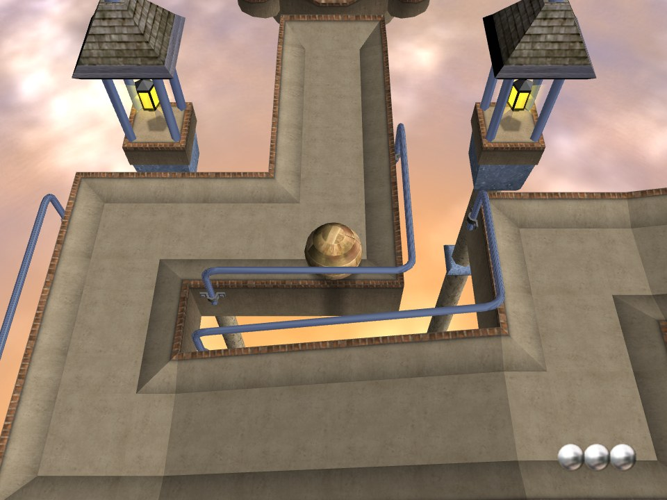

# OpenBallance

A faithful reimplementation of **Ballance** (Cyparade / Atari, 2004), running the original game's own
Virtools scripts on a new runtime, with a port of its Ipion physics engine. It uses the data from your own
copy of the game and runs on [gasm](https://gasm.emdzej.pl): natively on macOS, Linux and Windows, and in
the browser.

**Website, docs and the browser player: https://openballance.emdzej.pl**



## Quick start

```sh
gasm-run openballance.wasm --rom Ballance.iso          # a disc image
gasm-run openballance.wasm --asset-dir /path/to/game   # the CD or an installed copy
```

Or download a bundle from the [releases](https://github.com/emdzej/openballance/releases), or
[play in the browser](https://openballance.emdzej.pl/play/).
Controls, launch parameters and troubleshooting: [the user guide](https://openballance.emdzej.pl/guide/).

## How it works

Ballance keeps almost all of its game logic in Virtools behaviour graphs inside its `.cmo` / `.nmo` files.
OpenBallance loads those files into a CK2-compatible object model and executes the graphs; the Building
Blocks they call are ported from the original DLLs, and the physics is a port of the Ipion (IVP) engine
from `physics_RT.dll`. See [Architecture](https://openballance.emdzej.pl/internals/architecture) and the
specifications in [`docs/`](docs/).

## Building

```sh
tools/fetch-gasm-sdk.sh
cmake -S . -B build-gasm -DOPENBALLANCE_PLATFORM=gasm -DCMAKE_BUILD_TYPE=Release \
  -DCMAKE_TOOLCHAIN_FILE=.deps/gasm-c-sdk/cmake/gasm-toolchain.cmake -DWASI_SDK_PREFIX="$PWD/.deps/wasi-sdk"
cmake --build build-gasm -j        # build-gasm/openballance.wasm

cmake -S . -B build && cmake --build build -j   # native engine library + tests (need your game data)
```

## Legal

OpenBallance is licensed under the GPL-3.0. It contains no code or assets from Ballance: it needs your own
copy of the game. Ballance is © 2004 Cyparade / Atari. This project is not affiliated with them.
